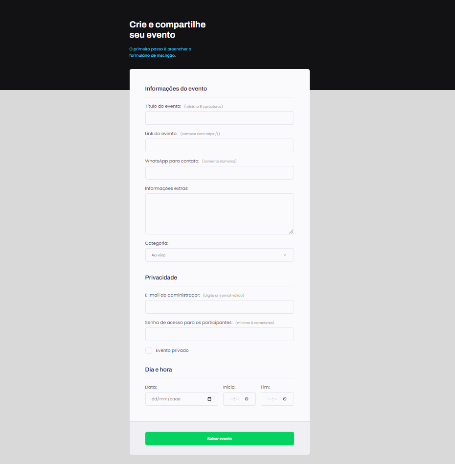

  

 
Com este módulo da Rocketseat foi possível me aprofundar bastante em Get e Post, campos de entrada, select, 
check-box, form, como usar input do tipo submit fora do form, 
atribuindo ID no form e um form no input do tipo submit ou até mesmo no button.
Aprendi também sobre Contrastes de acessibilidade/leitores e muito mais. 

## Tecnologias Utilizadas:

- Figma
- HTML
- CSS

## Link para o site:

- [Página](https://atiliom0reira.github.io/formulario-evento/)
